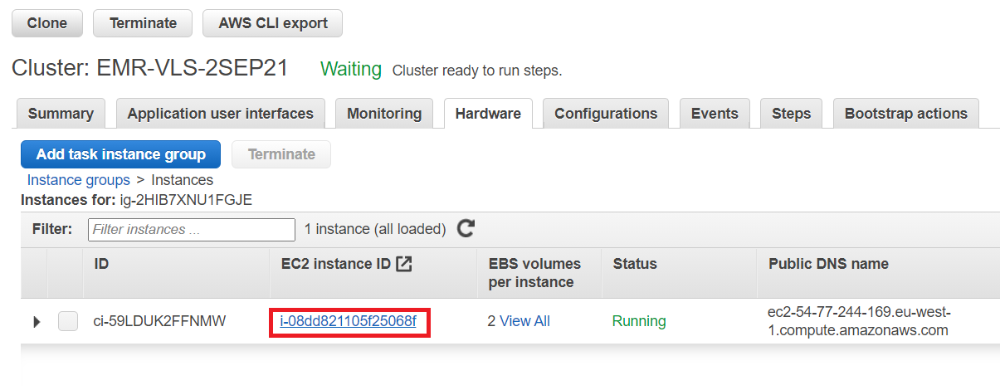
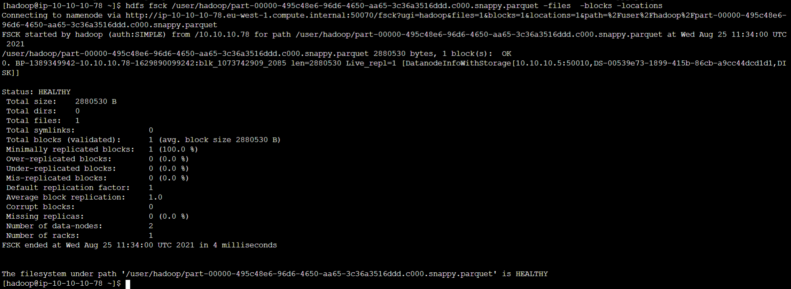
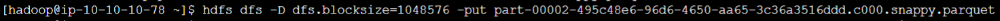
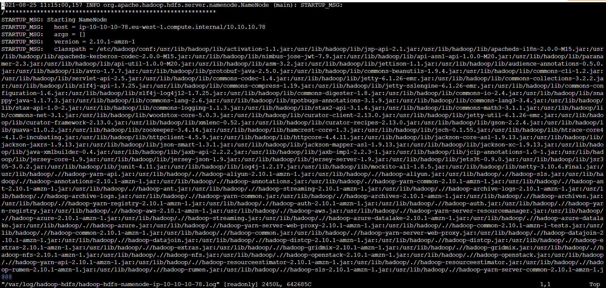

# Running HDFS commands

## Part 1: Login to EMR cluster master node using Session Manager
1. First navigate to the Hardware tab on the EMR Console page for your cluster.
2. Click on the Master instance group ID.

  

3. Click on the instance ID of the Master node.

  

4. Select the instance and then click on Connect at the top of the EC2 page.

  

5. Click on Session Manager, click Connect

  

6. Once the session loads, run `sudo su - hadoop` to switch to the hadoop user and to navigate to the hadoop user's home directory.

  

## Part 2: Demonstration of HDFS blocks, replication and sample commands.

1. Run the following command to list the content of the s3 location `s3://amazon-reviews-pds/parquet/product_category=Digital_Software/`
  ```
  aws s3 ls s3://amazon-reviews-pds/parquet/product_category=Digital_Software/
  ```
  
  

2. Copy the first file in the list to your home using the following command:
  ```
  aws s3 cp s3://amazon-reviews-pds/parquet/product_category=Digital_Software/part-00000-495c48e6-96d6-4650-aa65-3c36a3516ddd.c000.snappy.parquet .
  ```
  

3. Copy the file which you copied in the previous step from your home directory to HDFS using the command below:
  ```
  hdfs dfs -put part-00000-495c48e6-96d6-4650-aa65-3c36a3516ddd.c000.snappy.parquet /user/hadoop
  
  ```
  

  To verify that the file has been copied to HDFS (`/user/hadoop/part-00000-495c48e6-96d6-4650-aa65-3c36a3516ddd.c000.snappy.parquet`), you can run:
  ```
  hdfs dfs -ls /user/hadoop
  ```
  

4. Check the file block location for the above file using the command:
  ```
  hdfs fsck /user/hadoop/part-00000-495c48e6-96d6-4650-aa65-3c36a3516ddd.c000.snappy.parquet -files  -blocks -locations
  ```
  

  * What is the current replication factor?      
  * How many HDFS blocks were created from the file?
  * What is the size of a block from the above output?      

5. Set the replication of that file to 3 and then check the locations of the blocks again.
  ```
  hdfs dfs -setrep 3 /user/hadoop/part-00000-495c48e6-96d6-4650-aa65-3c36a3516ddd.c000.snappy.parquet
  hdfs fsck /user/hadoop/part-00000-495c48e6-96d6-4650-aa65-3c36a3516ddd.c000.snappy.parquet -files  -blocks -locations
  ```


6. Download a new file from the S3 location using the command:
```
aws s3 cp s3://amazon-reviews-pds/parquet/product_category=Digital_Software/part-00002-495c48e6-96d6-4650-aa65-3c36a3516ddd.c000.snappy.parquet .
```


7. Copy the new file to HDFS and specify that a block size of 1MB (1\*1024\*1024 bytes) should be used.
```
hdfs dfs -D dfs.blocksize=1048576 -put part-00002-495c48e6-96d6-4650-aa65-3c36a3516ddd.c000.snappy.parquet /user/hadoop
```


8. Check the new file using the below command:
```
hdfs fsck /user/hadoop/part-00002-495c48e6-96d6-4650-aa65-3c36a3516ddd.c000.snappy.parquet -files  -blocks -locations
```

## Part 3: HDFS administration

1. Check the Namenode logs to understand which data node has the block. To do this, please find and open the log file with a command-line editor (vi, vim, nano) and check. You can exit vim using `:q!`
  ```
  ls /var/log/hadoop-hdfs/
  vi /var/log/hadoop-hdfs/hadoop-hdfs-namenode-<IP address>.log
  ```
  

     

2. Log on to a core node and check the data node logs as well. 
To log on to core node, follow the same steps as used when connecting to the Master, but choose and instance from the Core instance group instead. After logging in to a Core node, check the data node logs in location `/var/log/hadoop-hdfs/`. The easiest way to do this is to run `ls /var/log/hadoop-hdfs/`, check the output for the log file and then run `vi /var/log/hadoop-hdfs/hadoop-hdfs-datanode-<node IP>.log`

  

  

  

  

  

  


  Search for the keywords “src:” and “dest:” to see the source and destination of blocks during replication. To do this using vim type "/src:" and "/dest:" after opening the file.


  

3. Log out of the core node and log on to the master node.

4. Copy another parquet file from the s3 location `s3://amazon-reviews-pds/parquet/product_category=Digital_Software/` to the master node home directory
  ```
  aws s3 cp s3://amazon-reviews-pds/parquet/product_category=Digital_Software/part-00003-495c48e6-96d6-4650-aa65-3c36a3516ddd.c000.snappy.parquet .
  ```

5. Check whether the name node is in safe mode.
  ```
  hdfs dfsadmin -safemode get
  ```

6. Set the name node to safemode using the command below and try to copy the new file to hdfs.
  ```
  hdfs dfsadmin -safemode enter
  ```
  

    You can run `hdfs dfsadmin -safemode get` again to confirm that Namenode is in  is safe mode,

7. Now, try to write to hdfs using the following command:
  ```
  hdfs dfs -put part-00003-495c48e6-96d6-4650-aa65-3c36a3516ddd.c000.snappy.parquet /user/hadoop
  ```

  What do you observe?

  

8.  Turn off safe mode by running the following command and repeat step 7 above. What do you observe?
  ```
  hdfs dfsadmin -safemode leave
  ```
  

9. Run the following command to see summary information about HDFS.
  ```
  hdfs dfsadmin -report
  ```
  

Congratulations, you have completed the HDFS lab.
