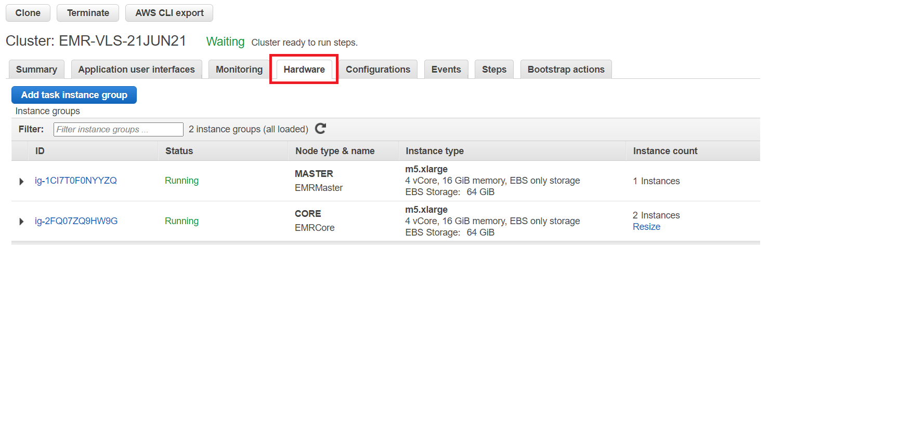
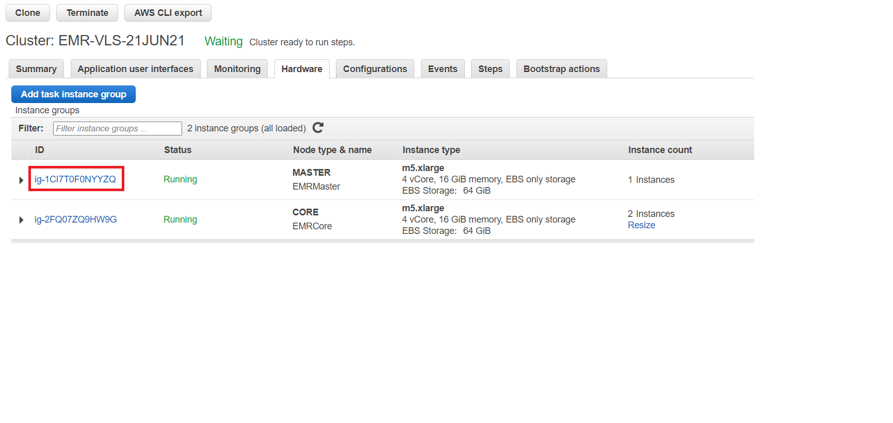
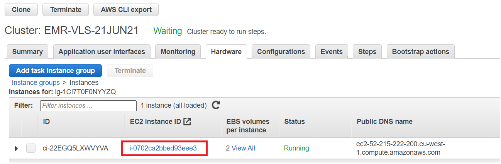
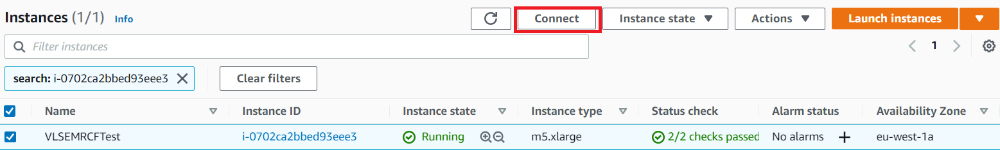

#  MapReduce Lab

## Part 1: Login to EMR cluster master node using Session Manager
1. First navigate to the Hardware tab on the EMR Console page for your cluster.
  
2. Click on the Master instance group ID.
  
3. Click on the instance ID of the Master node.
  
4. Select the instance and then click on Connect at the top of the EC2 page.
  
5. Click on Session Manager, click Connect
  
6. Once the session loads, run `sudo su hadoop` to switch to the hadoop user.
  

## Part 2: MapReduce Lab Steps

1. Download the Word Count.java
  ```
  wget https://raw.githubusercontent.com/apache/hadoop/trunk/hadoop-mapreduce-project/hadoop-mapreduce-examples/src/main/java/org/apache/hadoop/examples/WordCount.java
  ```
  

2. Create a directory

  ```
  mkdir -p build
  ```

3. Compile the wordcount program
  ```
  javac -cp /usr/lib/hadoop/*:/usr/lib/hadoop-mapreduce/* WordCount.java -d build -Xlint
  ```
  

4. Create the wordcount jar file
  ```
  jar -cvf wordcount.jar -C build/ .
  ```

5. Download the input file into local machine
  ```
  aws s3 cp s3://amazon-reviews-pds/tsv/amazon_reviews_us_Digital_Music_Purchase_v1_00.tsv.gz .
  ```

6. Gunzip the file
  ```
  gunzip amazon_reviews_us_Digital_Music_Purchase_v1_00.tsv.gz
  ```

7. Put the file into HDFS
  ```
  hdfs dfs -put amazon_reviews_us_Digital_Music_Purchase_v1_00.tsv /user/hadoop
  
  hdfs dfs -ls /user/hadoop/amazon_reviews_us_Digital_Music_Purchase_v1_00.tsv  
  ```
  
      

8. Run the Hadoop wordcount program
  ```
  hadoop jar wordcount.jar org.apache.hadoop.examples.WordCount /user/hadoop/amazon_reviews_us_Digital_Music_Purchase_v1_00.tsv /user/hadoop/output
  ```
  

9. Checking YARN logs
  * Application logs
  ```
  [hadoop@ip-10-0-3-125 ~]$ yarn application --list -appStates FINISHED 
  20/08/25 18:45:27 INFO client.RMProxy: Connecting to ResourceManager at ip-10-0-3-125.eu-west-1.compute.internal/10.0.3.125:8032
  Total number of applications (application-types: [] and states: [FINISHED]):1
                Application-Id	    Application-Name	    Application-Type	      User	     Queue	             State	       Final-State	       Progress	                       Tracking-URL
  application_1598380160354_0002	          word count	           MAPREDUCE	    hadoop	   default	          FINISHED	         SUCCEEDED	           100%	http://ip-10-0-3-125.eu-west-1.compute.internal:19888/jobhistory/job/job_1598380160354_0002

  ```
  
  ```
  [hadoop@ip-10-0-3-125 ~]$ yarn logs --applicationId application_1598380160354_0002 
    
  ``` 
  > You can view the output of logs in this the [appliactions_logs.txt](resources/logs.txt) file
  
  * Container logs 
    ```
    [hadoop@ip-10-0-3-125 ~]$ yarn applicationattempt -list application_1598380160354_0002
    20/08/25 18:50:28 INFO client.RMProxy: Connecting to ResourceManager at ip-10-0-3-125.eu-west-1.compute.internal/10.0.3.125:8032
    Total number of application attempts :1
             ApplicationAttempt-Id	               State	                    AM-Container-Id	                       Tracking-URL
    appattempt_1598380160354_0002_000001	            FINISHED	container_1598380160354_0002_01_000001	http://ip-10-0-3-125.eu-west-1.compute.internal:20888/proxy/application_1598380160354_0002/
    ```    
    
    ```
    [hadoop@ip-10-0-3-125 ~]$ yarn container -list appattempt_1598380160354_0002_000001
    20/08/25 18:56:12 INFO client.RMProxy: Connecting to ResourceManager at ip-10-0-3-125.eu-west-1.compute.internal/10.0.3.125:8032
    Total number of containers :0
                      Container-Id	          Start Time	         Finish Time	               State	                Host	   Node Http Address	                            LOG-URL

    ```
    
    ```
    [hadoop@ip-10-0-3-125 ~]$ yarn container -status container_1598380160354_0002_01_000001

 ```
