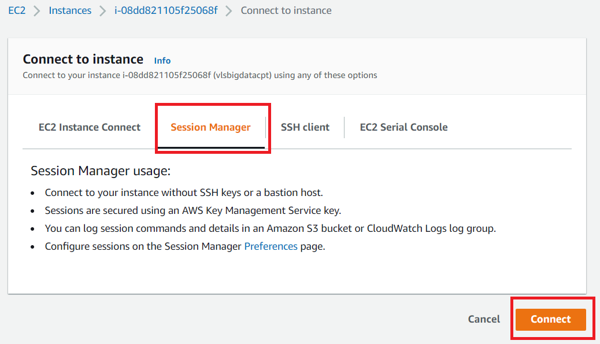

# MapReduce Lab

## Part 1. Login to EMR Master Node via an SSM session:

## Part 1: Login to EMR cluster master node using Session Manager
1. First navigate to the Hardware tab on the EMR Console page for your cluster.
2. Click on the Master instance group ID.

  

3. Click on the instance ID of the Master node.

  

4. Select the instance and then click on Connect at the top of the EC2 page.

  

5. Click on Session Manager, click Connect

  

6. Once the session loads, run `sudo su - hadoop` to switch to the hadoop user and to navigate to the hadoop user's home directory.

  
  
## Part 2: Download the wordcount.java program and compile it:

1.
  ```
  wget https://raw.githubusercontent.com/apache/hadoop/trunk/hadoop-mapreduce-project/hadoop-mapreduce-examples/src/main/java/org/apache/hadoop/examples/WordCount.java
  ```
  

2. Create a directory

  ```
  mkdir -p build
  ```

3. Compile the wordcount program
  ```
  javac -cp /usr/lib/hadoop/*:/usr/lib/hadoop-mapreduce/* WordCount.java -d build -Xlint
  ```
  


## Part 3: Create Wordcount jar and run the Wordcount application

1. Create the wordcount jar file
  ```
  jar -cvf wordcount.jar -C build/ .
  ```

2. Download the input file into local machine. File approximately 1.1 GB in size
  ```
   aws s3 cp s3://amazon-reviews-pds/tsv/amazon_reviews_us_Pet_Products_v1_00.tsv.gz .  
  ```

3. Use Gunzip tool to uncompress the file
  ```
  gunzip amazon_reviews_us_Pet_Products_v1_00.tsv.gz
  ```
4. Change file block size to 256MB and move the data file to /user/hadoop/ directory in HDFS. Then confirm the block size change on the file.

  ```
  hdfs dfs -Ddfs.blocksize=268435456 -put amazon_reviews_us_Pet_Products_v1_00.tsv /user/hadoop/

  hdfs fsck /user/hadoop/amazon_reviews_us_Pet_Products_v1_00.tsv -files -blocks
  ```
      

5. Run the Hadoop wordcount program

  ```
  hadoop jar wordcount.jar org.apache.hadoop.examples.WordCount /user/hadoop/amazon_reviews_us_Pet_Products_v1_00.tsv /user/hadoop/output
  ```
  

  

6. View the wordcount output file. You can use Ctrl_C to stop the results as the file is big
  ```
  hdfs dfs -cat /user/hadoop/output/part-r-00000
  ```

## Part 4: Monitor the wordCount application from YARN

 > Checking YARN logs
  * Application logs
  ```
  [hadoop@ip-172-31-6-40 ~]$ yarn application --list -appStates FINISHED
21/08/25 17:55:03 INFO client.RMProxy: Connecting to ResourceManager at ip-172-31-6-40.us-west-2.compute.internal/172.31.6.40:8032
21/08/25 17:55:03 INFO client.AHSProxy: Connecting to Application History server at ip-172-31-6-40.us-west-2.compute.internal/172.31.6.40:10200
Total number of applications (application-types: [], states: [FINISHED] and tags: []):1
                Application-Id      Application-Name        Application-Type          User           Queue                   State             Final-State             Progress                        Tracking-URL
application_1629892425808_0001            word count               MAPREDUCE        hadoop         default                FINISHED               SUCCEEDED                 100% http://ip-172-31-6-40.us-west-2.compute.internal:19888/jobhistory/job/job_1629892425808_0001

  ```
  
  ```
  [hadoop@ip-10-0-3-125 ~]$ yarn logs --applicationId application_1629892425808_0001  
    
  ``` 
  > You can view the output of logs in this the [application_logs.txt](resources/logs.txt) file
  
  * Container logs 
    ```
    [hadoop@ip-172-31-6-40 ~]$ yarn applicationattempt -list application_1629892425808_0001
21/08/25 17:59:46 INFO client.RMProxy: Connecting to ResourceManager at ip-172-31-6-40.us-west-2.compute.internal/172.31.6.40:8032
21/08/25 17:59:46 INFO client.AHSProxy: Connecting to Application History server at ip-172-31-6-40.us-west-2.compute.internal/172.31.6.40:10200
Total number of application attempts :1
         ApplicationAttempt-Id                 State                        AM-Container-Id                            Tracking-URL
appattempt_1629892425808_0001_000001                FINISHED    container_1629892425808_0001_01_000001  http://ip-172-31-6-40.us-west-2.compute.internal:20888/proxy/application_1629892425808_0001/
    ```    
    
    ```
    [hadoop@ip-172-31-6-40 ~]$ yarn container -list appattempt_1629892425808_0001_000001
21/08/25 18:01:37 INFO client.RMProxy: Connecting to ResourceManager at ip-172-31-6-40.us-west-2.compute.internal/172.31.6.40:8032
21/08/25 18:01:37 INFO client.AHSProxy: Connecting to Application History server at ip-172-31-6-40.us-west-2.compute.internal/172.31.6.40:10200
Total number of containers :11
                  Container-Id            Start Time             Finish Time                   State                    Host       Node Http Address                                LOG-URL
container_1629892425808_0001_01_000011  Wed Aug 25 17:49:15 +0000 2021  Wed Aug 25 17:49:22 +0000 2021              COMPLETE    ip-172-31-7-145.us-west-2.compute.internal:8041 http://ip-172-31-7-145.us-west-2.compute.internal:8042  http://ip-172-31-6-40.us-west-2.compute.internal:8188/applicationhistory/logs/ip-172-31-7-145.us-west-2.compute.internal:8041/container_1629892425808_0001_01_000011/container_1629892425808_0001_01_000011/hadoop


container_1629892425808_0001_01_000010  Wed Aug 25 17:49:11 +0000 2021  Wed Aug 25 17:49:21 +0000 2021              COMPLETE    ip-172-31-7-145.us-west-2.compute.internal:8041 http://ip-172-31-7-145.us-west-2.compute.internal:8042  http://ip-172-31-6-40.us-west-2.compute.internal:8188/applicationhistory/logs/ip-172-31-7-145.us-west-2.compute.internal:8041/container_1629892425808_0001_01_000010/container_1629892425808_0001_01_000010/hadoop


container_1629892425808_0001_01_000009  Wed Aug 25 17:48:55 +0000 2021  Wed Aug 25 17:49:19 +0000 2021              COMPLETE    ip-172-31-15-89.us-west-2.compute.internal:8041 http://ip-172-31-15-89.us-west-2.compute.internal:8042  http://ip-172-31-6-40.us-west-2.compute.internal:8188/applicationhistory/logs/ip-172-31-15-89.us-west-2.compute.internal:8041/container_1629892425808_0001_01_000009/container_1629892425808_0001_01_000009/hadoop


container_1629892425808_0001_01_000008  Wed Aug 25 17:48:55 +0000 2021                   N/A                    null    ip-172-31-7-145.us-west-2.compute.internal:8041 http://ip-172-31-7-145.us-west-2.compute.internal:8042  http://ip-172-31-6-40.us-west-2.compute.internal:8188/applicationhistory/logs/ip-172-31-7-145.us-west-2.compute.internal:8041/container_1629892425808_0001_01_000008/container_1629892425808_0001_01_000008/hadoop


container_1629892425808_0001_01_000007  Wed Aug 25 17:48:34 +0000 2021  Wed Aug 25 17:49:15 +0000 2021              COMPLETE    ip-172-31-7-145.us-west-2.compute.internal:8041 http://ip-172-31-7-145.us-west-2.compute.internal:8042  http://ip-172-31-6-40.us-west-2.compute.internal:8188/applicationhistory/logs/ip-172-31-7-145.us-west-2.compute.internal:8041/container_1629892425808_0001_01_000007/container_1629892425808_0001_01_000007/hadoop


container_1629892425808_0001_01_000006  Wed Aug 25 17:47:37 +0000 2021  Wed Aug 25 17:48:34 +0000 2021              COMPLETE    ip-172-31-7-145.us-west-2.compute.internal:8041 http://ip-172-31-7-145.us-west-2.compute.internal:8042  http://ip-172-31-6-40.us-west-2.compute.internal:8188/applicationhistory/logs/ip-172-31-7-145.us-west-2.compute.internal:8041/container_1629892425808_0001_01_000006/container_1629892425808_0001_01_000006/hadoop


container_1629892425808_0001_01_000005  Wed Aug 25 17:47:37 +0000 2021  Wed Aug 25 17:49:11 +0000 2021              COMPLETE    ip-172-31-7-145.us-west-2.compute.internal:8041 http://ip-172-31-7-145.us-west-2.compute.internal:8042  http://ip-172-31-6-40.us-west-2.compute.internal:8188/applicationhistory/logs/ip-172-31-7-145.us-west-2.compute.internal:8041/container_1629892425808_0001_01_000005/container_1629892425808_0001_01_000005/hadoop


container_1629892425808_0001_01_000004  Wed Aug 25 17:47:37 +0000 2021  Wed Aug 25 17:49:15 +0000 2021              COMPLETE    ip-172-31-7-145.us-west-2.compute.internal:8041 http://ip-172-31-7-145.us-west-2.compute.internal:8042  http://ip-172-31-6-40.us-west-2.compute.internal:8188/applicationhistory/logs/ip-172-31-7-145.us-west-2.compute.internal:8041/container_1629892425808_0001_01_000004/container_1629892425808_0001_01_000004/hadoop


container_1629892425808_0001_01_000003  Wed Aug 25 17:47:36 +0000 2021  Wed Aug 25 17:48:55 +0000 2021              COMPLETE    ip-172-31-15-89.us-west-2.compute.internal:8041 http://ip-172-31-15-89.us-west-2.compute.internal:8042  http://ip-172-31-6-40.us-west-2.compute.internal:8188/applicationhistory/logs/ip-172-31-15-89.us-west-2.compute.internal:8041/container_1629892425808_0001_01_000003/container_1629892425808_0001_01_000003/hadoop


container_1629892425808_0001_01_000002  Wed Aug 25 17:47:36 +0000 2021  Wed Aug 25 17:48:55 +0000 2021              COMPLETE    ip-172-31-15-89.us-west-2.compute.internal:8041 http://ip-172-31-15-89.us-west-2.compute.internal:8042  http://ip-172-31-6-40.us-west-2.compute.internal:8188/applicationhistory/logs/ip-172-31-15-89.us-west-2.compute.internal:8041/container_1629892425808_0001_01_000002/container_1629892425808_0001_01_000002/hadoop


container_1629892425808_0001_01_000001  Wed Aug 25 17:47:30 +0000 2021  Wed Aug 25 17:49:29 +0000 2021              COMPLETE    ip-172-31-15-89.us-west-2.compute.internal:8041 http://ip-172-31-15-89.us-west-2.compute.internal:8042  http://ip-172-31-6-40.us-west-2.compute.internal:8188/applicationhistory/logs/ip-172-31-15-89.us-west-2.compute.internal:8041/container_1629892425808_0001_01_000001/container_1629892425808_0001_01_000001/hadoop

    ```
    
    ```
    [hadoop@ip-10-0-3-125 ~]$ yarn container -status container_1629892425808_0001_01_000002 

    ```
