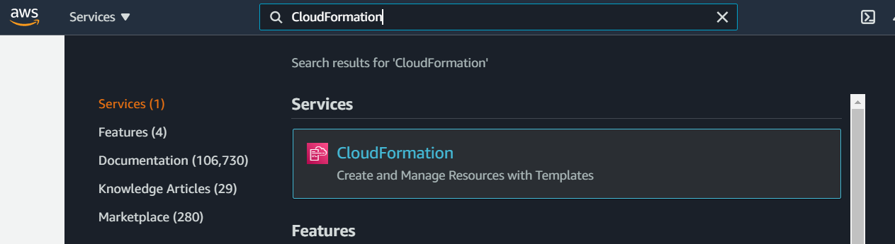
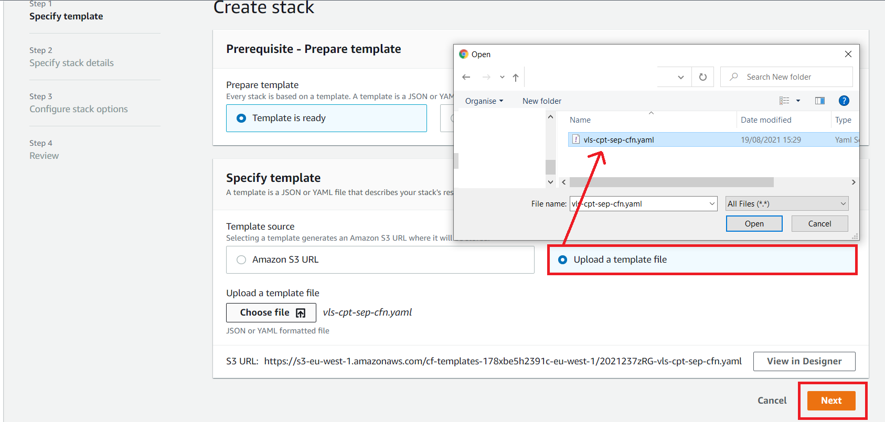
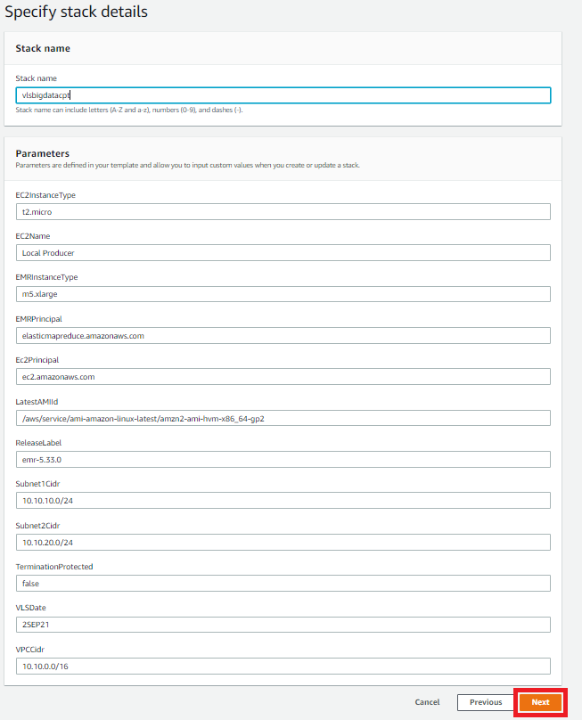
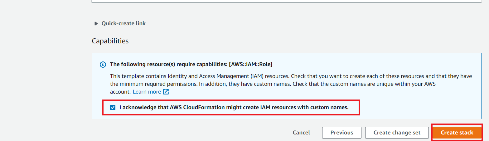
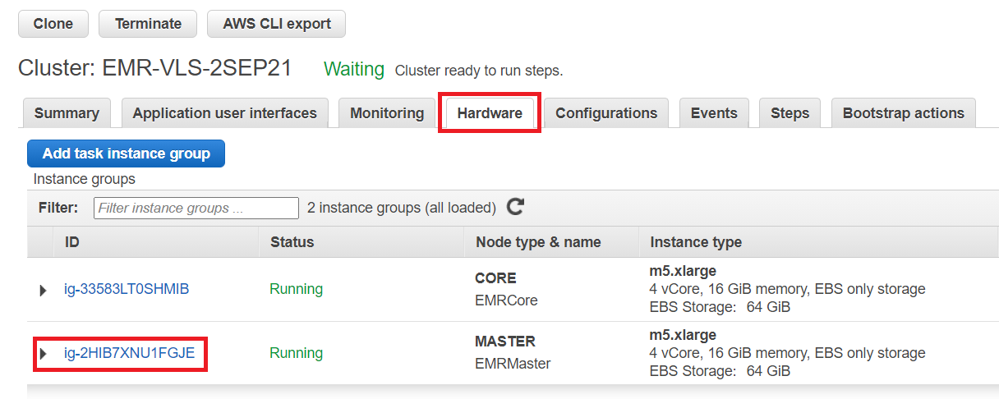
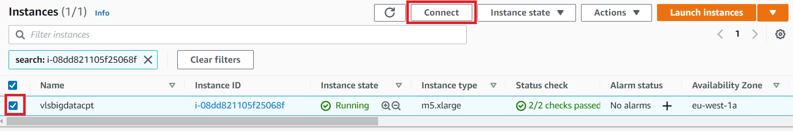

# Environment setup

1. Switch the region to eu-west-1 - Ireland.

2. Download the CloudFormation template [here](https://raw.githubusercontent.com/aws-support-bigdata-cpt-vls/2021/main/Day%201/Initial%20setup/vls-cpt-sep-cfn-one.yaml).
3. Search for CloudFormation on the service list.

4. Select "Create stack".

5. Select the template downloaded in step 2 above and click Next.

6. Provide the stack as below and click Next.

7. Scroll down and click Next.

8. Acknowledge the creation of IAM Roles and create the stack.

9. Environment creation is initiated.

10. Once the stack has finished creating, search for EMR from the service list, navigate to the EMR page and click on the Clusters >> Select your cluster >> Hardware tab >> Master Instance group:

11. Click the master instance to navigate to the EC2 console:

12. To connect to the instance, we use Session Manager. Click the check box and click connect:

13. Select the Session Manager tab and click connect:

14. Change user to Hadoop for the EMR Cluster (sudo su - hadoop) or ec2-user (sudo su - ec2-user) for the EC2 instance as below.

