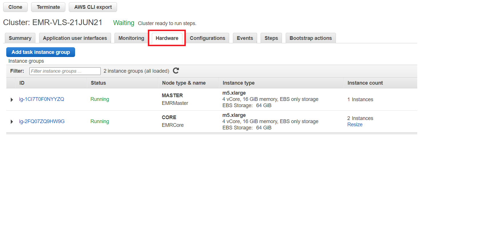
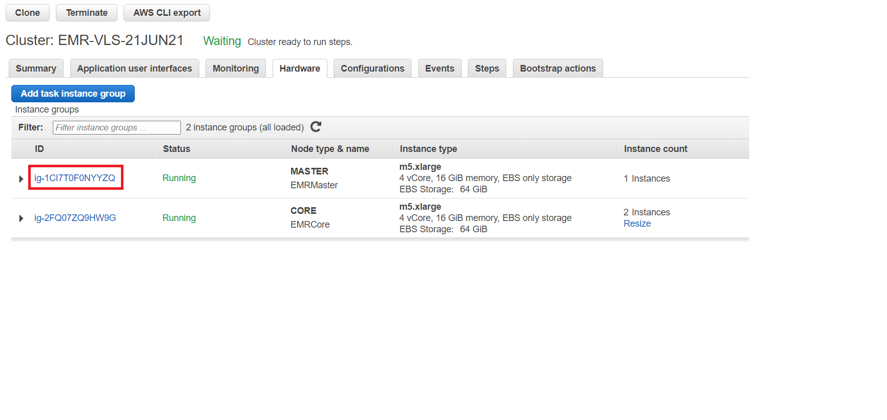
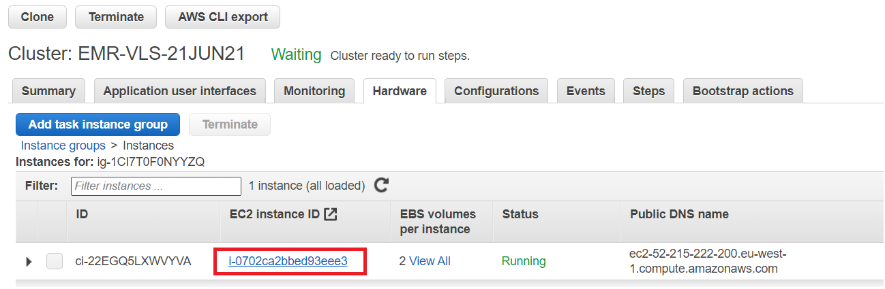
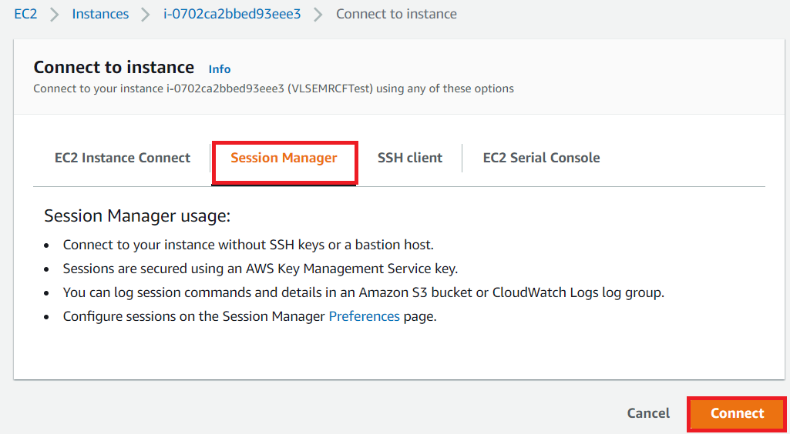
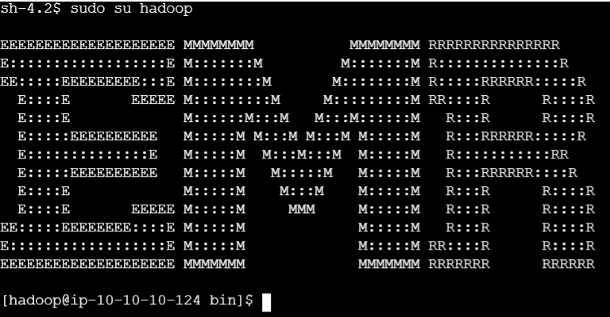
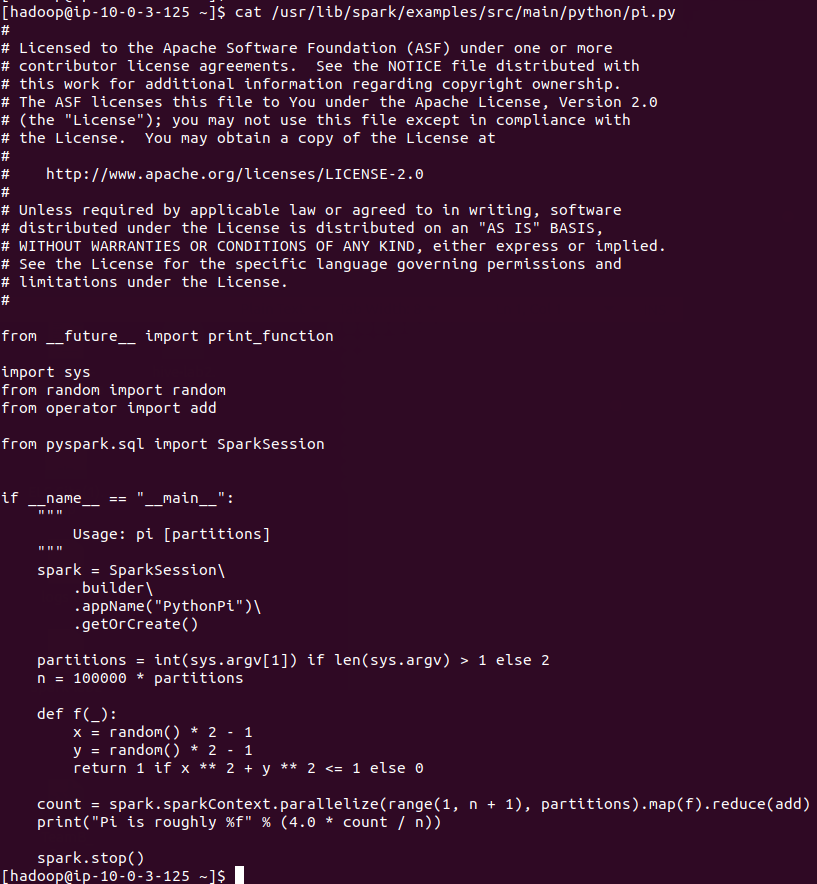

## Part 1: Login to EMR cluster master node using Session Manager
1. First navigate to the Hardware tab on the EMR Console page for your cluster.
  
2. Click on the Master instance group ID.
  
3. Click on the instance ID of the Master node.
  
4. Select the instance and then click on Connect at the top of the EC2 page.
  
5. Click on Session Manager, click Connect
  
6. Once the session loads, run `sudo su hadoop` to switch to the hadoop user.
  


## Part 2: Spark Lab - YARN cluster/YARN client/local mode

1. sparkpi display the content of sparkpi
    ```
    cat /usr/lib/spark/examples/src/main/python/pi.py
    ```

    

2. Run on YARN cluster in client mode
    ```
    /usr/bin/spark-submit \
    --class org.apache.spark.examples.SparkPi \
    --master yarn \
    --deploy-mode client \
    /usr/lib/spark/examples/jars/spark-examples.jar \
    10

    ```

    > You can view output of how the command should like here: [output.txt](resources/2_client_mode.txt)

3. Run on YARN cluster in cluster mode
    ```
    /usr/bin/spark-submit \
    --class org.apache.spark.examples.SparkPi \
    --master yarn \
    --deploy-mode cluster \
    /usr/lib/spark/examples/jars/spark-examples.jar \
    10

    ```

    > You can view output of how the command should like here: [output.txt](resources/3_cluster_mode.txt)

4. Python word count running locally on 5 cores
    ```
    cd /usr/lib/spark/
    /usr/bin/spark-submit --master local[4] /usr/lib/spark/examples/src/main/python/wordcount.py 'file:///usr/lib/spark/examples/src/main/resources/people.txt'
    ```

    > You can view output of how the command should like here: [output.txt](resources/4_wordCount.txt)

5. Python word count hdfs
    ```
    hdfs dfs -put /usr/lib/spark/examples/src/main/resources/people.txt /user/hadoop
    hdfs dfs -ls /user/hadoop

    ```
    > You can view output of how the command should like here: [output.txt](resources/5_hdfs.txt)

    ```    
    /usr/bin/spark-submit /usr/lib/spark/examples/src/main/python/wordcount.py /user/hadoop/people.txt
    ```    
    > You can view output of how the command should like here: [output.txt](resources/6_spark_hdfs.txt)

